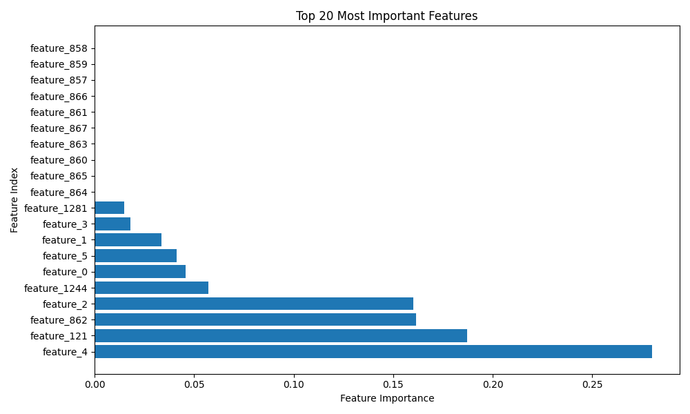

# XGBoost를 사용한 PE 악성코드 탐지

이 프로젝트는 XGBoost 분류기를 사용하여 악성 PE(Portable Executable) 파일을 탐지하는 것을 목표로 합니다. PE 파일에서 다양한 특성을 추출하고, XGBoost 모델을 훈련하며, 모델의 성능을 평가합니다.

## 주요 기능

- 파일 크기, 컴파일 시간, 섹션 수, API 호출, 섹션 정보, 엔트로피, 리소스, 인증서 정보 등 PE 파일 정보 추출
- 결측값 처리 및 범주형 특성 인코딩을 통한 추출된 데이터 전처리
- 전처리된 데이터를 사용하여 XGBoost 분류기 훈련
- 정확도, 정밀도, 재현율, F1 점수 등의 평가 지표를 사용하여 훈련된 모델 평가
- 검증 손실, 오류, AUC를 포함한 훈련 과정 시각화
- 분류에 기여하는 가장 중요한 특성 식별 및 시각화

## 결과

훈련된 XGBoost 모델은 테스트 세트에서 다음과 같은 성능 지표를 달성했습니다:

- 정확도: 0.9759450171821306
- 정밀도: 0.9642857142857143
- 재현율: 1.0
- F1 점수: 0.9818181818181818

훈련 과정 그래프는 훈련 중 모델 성능의 진행 상황을 보여줍니다:

특성 중요도 시각화는 분류 작업에 가장 중요한 상위 20개 특성을 강조 표시합니다:

## 사용 방법

사용 방법

1. Pipenv를 설치합니다: pip install pipenv
2. 프로젝트 디렉토리로 이동합니다: cd your-project-directory
3. 새로운 가상 환경을 생성합니다: pipenv --python 3.x
4. 필요한 패키지를 설치합니다: pipenv install
5. config.ini 파일에 지정된 각 폴더에 악성 및 정상 PE 파일을 배치합니다.
6. 가상 환경을 활성화합니다: pipenv shell
7. PE_analysis.py 스크립트를 실행하여 PE 파일 정보를 추출하고 CSV 파일로 저장합니다.
8. malware_XGBoost.py 스크립트를 실행하여 데이터를 전처리하고, XGBoost 모델을 훈련하고, 모델의 성능을 평가하며, 시각화를 생성합니다.

## 종속성

- Python 3.x
- pandas
- scikit-learn
- xgboost
- cupy
- matplotlib
- seaborn
- pefile
